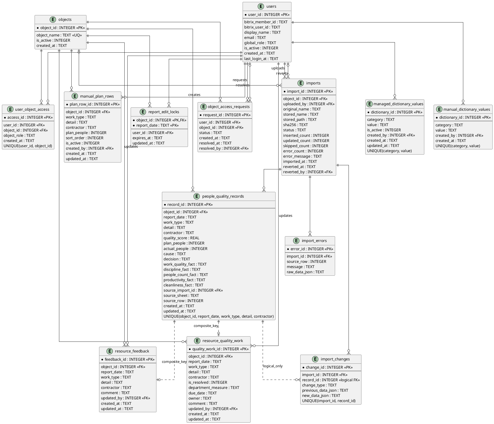
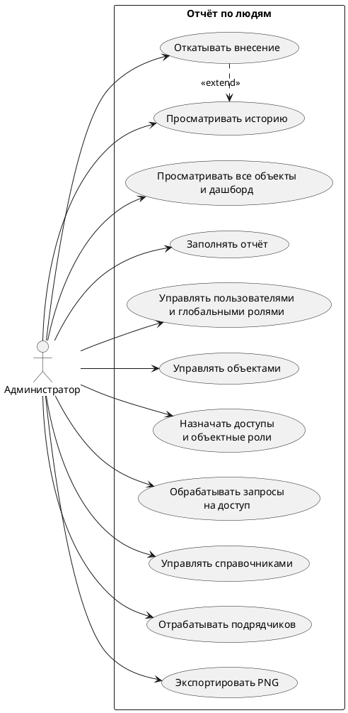
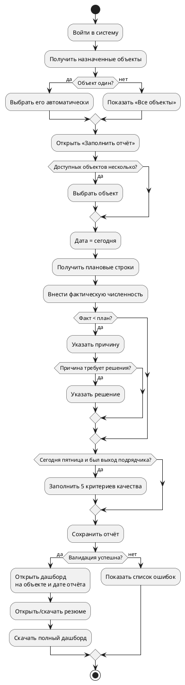
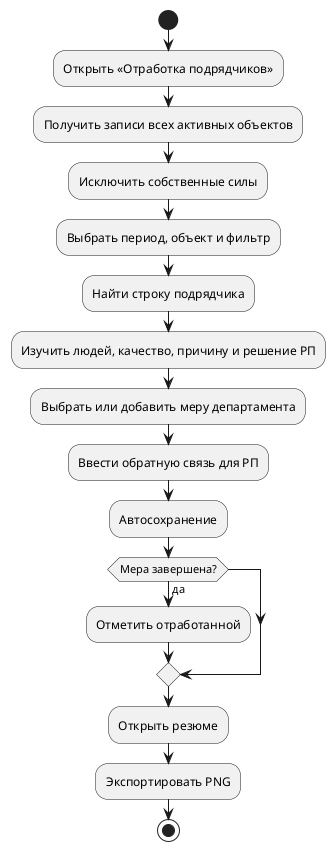
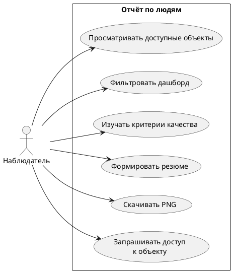

# Система «Отчёт по людям» — техническая документация

Дата аудита: 10.09.2026.

## 1. Назначение

Система предназначена для ежедневного сбора плановой и фактической численности людей на строительных объектах, фиксации причин отклонений и решений руководителя проекта, еженедельной оценки подрядчиков по пяти критериям, формирования управленческого дашборда и отработки проблем Департаментом ресурсов.

## 2. Роли и права

| Роль | Просмотр | Изменение |
|---|---|---|
| Администратор | Все активные объекты, отчёты, история, отработка | Пользователи, объекты, доступы, справочники, отчёты, меры, откат внесений |
| Руководитель проекта | Только назначенные объекты | Ежедневный отчёт только по объектам с объектной ролью `project_manager`, только за текущий день |
| Департамент ресурсов | Все активные объекты | Меры департамента, комментарии РП, статус отработки, справочник мер |
| Наблюдатель | Только назначенные объекты | Нет; может запросить доступ к объекту |

Глобальная роль хранится в `users.global_role`. Доступ к конкретному объекту хранится отдельно в `user_object_access.object_role`.

## 3. Архитектурный обзор

- Клиент: React 19, Vite, одностраничное приложение.
- API: Fastify 5, синхронный драйвер `node:sqlite`.
- Хранилище: один файл SQLite, WAL-режим, внешние ключи включены.
- Экспорт: `html2canvas`, PNG создаётся в браузере.
- Авторизация: в текущей среде только `AUTH_MODE=dev`; пользователь выбирается заголовком `x-dev-user-id`.
- Развёртывание: Node.js либо один Docker-контейнер. В production Fastify раздаёт собранный React и API на одном origin.

## 4. C4 — контекст системы

```plantuml
@startuml C4_Context
!includeurl https://raw.githubusercontent.com/plantuml-stdlib/C4-PlantUML/master/C4_Context.puml

title Система «Отчёт по людям» — System Context

Person(pm, "Руководитель проекта", "Ежедневно вводит факт, причины, решения и недельную оценку")
Person(resource, "Департамент ресурсов", "Отрабатывает отклонения подрядчиков")
Person(admin, "Администратор", "Управляет пользователями, объектами, доступами и справочниками")
Person(observer, "Наблюдатель", "Просматривает доступные отчёты")
System(report, "Отчёт по людям", "Сбор данных, аналитика, качество и отработка подрядчиков")
System_Ext(bitrix, "Bitrix24", "Будущий поставщик идентичности и контекста запуска")

Rel(pm, report, "Вводит и анализирует данные", "HTTPS/JSON")
Rel(resource, report, "Просматривает отклонения и фиксирует меры", "HTTPS/JSON")
Rel(admin, report, "Администрирует и контролирует историю", "HTTPS/JSON")
Rel(observer, report, "Просматривает разрешённые объекты", "HTTPS/JSON")
Rel(bitrix, report, "Передаёт контекст пользователя", "не реализовано")
@enduml
```

## 5. C4 — контейнеры

```plantuml
@startuml C4_Container
!includeurl https://raw.githubusercontent.com/plantuml-stdlib/C4-PlantUML/master/C4_Container.puml

title Система «Отчёт по людям» — Container Diagram

Person(user, "Пользователь", "Администратор, РП, Департамент ресурсов или наблюдатель")

System_Boundary(system, "Отчёт по людям") {
  Container(web, "Web SPA", "React 19, Vite", "Дашборд, формы, фильтры, PNG-экспорт")
  Container(api, "Application API", "Node.js 22, Fastify 5", "Авторизация, бизнес-правила, транзакции, REST API")
  ContainerDb(db, "Operational Database", "SQLite + WAL", "Пользователи, объекты, отчёты, качество, меры и аудит")
  ContainerDb(draft, "Локальные черновики", "Browser localStorage", "Несохранённые формы пользователя")
}

System_Ext(bitrix, "Bitrix24", "Планируемая production-аутентификация")

Rel(user, web, "Работает", "Browser")
Rel(web, api, "Читает и сохраняет", "REST/JSON, same-origin")
Rel(web, draft, "Автосохраняет/восстанавливает")
Rel(api, db, "SQL, транзакции")
Rel(bitrix, api, "Контекст запуска", "не реализовано")
@enduml
```

## 6. C4 — компоненты API

```plantuml
@startuml C4_Component
!includeurl https://raw.githubusercontent.com/plantuml-stdlib/C4-PlantUML/master/C4_Component.puml

title Fastify API — Component Diagram

Container_Boundary(api, "Application API") {
  Component(auth, "Auth & RBAC", "auth/index.js", "Определяет пользователя, глобальную роль и доступ к объектам")
  Component(session, "Session API", "routes/session.js", "Текущий пользователь и dev-переключение")
  Component(dashboard, "Dashboard API", "routes/dashboard.js", "Объекты, даты и записи дашборда")
  Component(manual, "Manual Report API", "routes/manual.js", "Блокировки, форма, валидация, сохранение отчёта и качества")
  Component(history, "History API", "routes/history.js", "Журнал внесений и откат")
  Component(resource, "Resource Work API", "routes/feedback.js", "Меры, ОС для РП и статус отработки")
  Component(admin, "Administration API", "routes/admin.js", "Пользователи, объекты, доступы и справочники")
  Component(rules, "Domain Rules", "manual/manual-report.js", "Причины, решения, критерии и формула качества")
  Component(dbaccess, "SQLite Adapter", "database/index.js", "Соединение, DDL и транзакции")
}

ContainerDb(db, "SQLite", "report.sqlite")
Container(web, "React SPA", "Web client")

Rel(web, auth, "Каждый API-запрос")
Rel(web, session, "GET session")
Rel(web, dashboard, "GET objects/records")
Rel(web, manual, "GET/POST report")
Rel(web, history, "GET/revert")
Rel(web, resource, "GET/PUT measures")
Rel(web, admin, "Admin CRUD")
Rel(manual, rules, "Валидирует и рассчитывает")
Rel(dashboard, rules, "Сверяет итог качества")
Rel(auth, dbaccess, "SQL")
Rel(session, dbaccess, "SQL")
Rel(dashboard, dbaccess, "SQL")
Rel(manual, dbaccess, "SQL/transaction")
Rel(history, dbaccess, "SQL/transaction")
Rel(resource, dbaccess, "SQL/transaction")
Rel(admin, dbaccess, "SQL/transaction")
Rel(dbaccess, db, "node:sqlite")
@enduml
```

## 7. ER-схема базы данных



`v_people_quality_all` — представление над `people_quality_records` и `objects`; добавляет имя объекта и вычисляет `deviation = actual_people - plan_people`.

## 8. Бизнес-логика

### 8.1 Доступ к объектам

Администратор и Департамент ресурсов видят все активные объекты. РП и наблюдатель видят только объекты из `user_object_access`. Право РП изменять отчёт требует объектной роли `project_manager`.

### 8.2 Ежедневный отчёт

1. Для нового дня форма загружает активные `manual_plan_rows`.
2. При отсутствии плановых строк используются строки последнего отчёта объекта.
3. Для нового дня план заполнен, факт/причина/решение пусты.
4. Изменения формы сохраняются как локальный черновик браузера.
5. Сервер разрешает изменение только за локальную текущую дату.
6. Блокировка `(object_id, report_date)` живёт 15 минут и продлевается клиентом каждые 4 минуты.
7. При `actual < plan` у подрядчика обязательна причина.
8. Для причин ответственности подрядчика обязательно решение.
9. Бизнес-ключ записи: объект + дата + вид работы + детализация + подрядчик.
10. Сохранение выполняется транзакционно: обновляется план, создаётся `imports`, вставляются/обновляются записи и журнал изменений.

### 8.3 Недельное качество

В пятницу для каждого подрядчика и вида работы с ненулевым недельным фактом обязательны пять критериев: качество, ТБ/дисциплина, люди, объём и чистота. Каждый имеет вес `0.2`; итог — среднее пяти значений с округлением до одного знака. Недельная оценка распространяется на записи той же недели по объекту, подрядчику и виду работы.

### 8.4 Дашборд

Данные ограничиваются доступными объектами, датой/периодом и фильтрами. Кросс-фильтрация работает по подрядчику, виду работы, причине и решению. План и факт суммируются. Отклонение равно факту минус план. Качество — среднее по оценённым строкам. Резюме и полный дашборд экспортируются в PNG.

### 8.5 Отработка подрядчиков

Показываются все записи подрядчиков, кроме собственных сил. Строка имеет ключ объект + дата + вид работы + детализация + подрядчик. Департамент ресурсов или администратор выбирает меру, вводит ОС для РП и может отметить работу выполненной. Изменения сохраняются автоматически в `resource_quality_work`.

### 8.6 История и откат

Каждое ручное сохранение создаёт запись `imports` с SHA вида `manual:<uuid>` и `import_changes`. Администратор может откатить только завершённое внесение, если затронутые записи не были изменены более новым внесением.

## 9. UML use case — Администратор



## 10. UML activity — Руководитель проекта



## 11. UML activity — Департамент ресурсов



## 12. UML use case — Наблюдатель



## 13. Аудит хранения данных

### Фактическое состояние

- `PRAGMA integrity_check`: `ok`.
- Нарушения внешних ключей: `0`.
- Дубли ключа отчёта: `0`.
- Дубли ключа плановых строк: `0`.
- Все 14 импортов имеют статус `completed`.
- 513 строк отчётов, 420 записей истории, 19 записей отработки, 5 legacy-записей обратной связи.
- Осиротевших `resource_quality_work`, `resource_feedback` и `import_changes`: `0`.
- `plan_people` и `actual_people` заполнены во всех текущих строках.
- У 71 записи пустой подрядчик: 59 — собственные силы, 12 — другие работы. Схема это допускает.

### Что записывается корректно

- пользователи, роли, активность и последний вход;
- объекты и их активность;
- доступ пользователя к объекту;
- запрос и решение по доступу;
- план, факт, причина, решение, пять критериев и итог качества;
- источник ручного внесения и базовый журнал изменений;
- управляемые справочники;
- мера, комментарий, исполнитель, срок и признак выполнения — если они пришли в API;
- локальные черновики — только в браузере, не в SQLite.

### Обнаруженные разрывы

1. **Критично — пятничный аудит.** В одном сохранении текущая запись сначала журналируется как insert/update, затем недельное обновление качества повторно вставляет `import_changes` для того же `(import_id, record_id)`. Ограничение `UNIQUE(import_id, record_id)` может откатить всю транзакцию.
2. **Высокий — откат неполный.** История откатывает только `people_quality_records`. Изменения `manual_plan_rows` и справочников, сделанные тем же сохранением, не откатываются.
3. **Высокий — production-аутентификация не реализована.** При `AUTH_MODE != dev` API отвечает `501`; секрет сессии и параметры Bitrix сейчас не участвуют в рабочем потоке.
4. **Средний — логические связи без FK.** `resource_quality_work`, `resource_feedback` и `import_changes.record_id` связаны с отчётом только логически. Удаление/откат записи может оставить сирот; сейчас сирот нет.
5. **Средний — дублирование качества.** `quality_score` хранится отдельно от пяти формулировок. В базе уже встречались несогласованные значения. API теперь пересчитывает итог при полных критериях, но сама сохранённая база остаётся денормализованной.
6. **Средний — пустой подрядчик разрешён сервером и схемой.** Клиент требует подрядчика, серверная валидация — нет; API можно вызвать в обход клиента.
7. **Средний — два справочника.** `manual_dictionary_values` и `managed_dictionary_values` перекрывают друг друга. Первый фактически legacy и усложняет источник истины.
8. **Средний — миграции ad hoc.** Нет таблицы версий и последовательных миграционных файлов; изменения структуры выполняются условным кодом при старте.
9. **Низкий — поля файлового импорта не используются.** `stored_name`, `stored_path`, `skipped_count`, `error_count` и `import_errors` предусмотрены, но текущий UI реализует только ручной ввод.
10. **Низкий — срок и исполнитель меры не доступны в основном рабочем экране.** База и API их сохраняют, однако текущая таблица редактирует только меру и комментарий; новые `due_date` и `owner` обычно остаются пустыми.

## 14. Рекомендации

1. Исправить журнал пятничного сохранения: делать один агрегированный `import_changes` на запись либо `UPSERT` с корректным исходным `previous_data_json`.
2. Включить изменения плана в отдельный аудит или явно объявить, что откат касается только факта.
3. Добавить настоящую FK-сущность `record_id` в `resource_quality_work` и журнал; отказаться от строкового составного связывания.
4. Оставить один управляемый справочник.
5. Ввести миграции с `schema_version` и резервным копированием перед изменением DDL.
6. Усилить серверную валидацию обязательного подрядчика и формата дат.
7. Хранить числовые оценки критериев либо вычислять итог всегда, исключив независимое редактирование `quality_score`.
8. Реализовать production-аутентификацию до публикации за пределами доверенной локальной сети.
9. Добавить интеграционные тесты полного сохранения пятницы, отката, конкурентной блокировки и RBAC.
10. Настроить резервное копирование `report.sqlite`, `-wal` и `-shm` согласованным SQLite snapshot/backup-механизмом.

